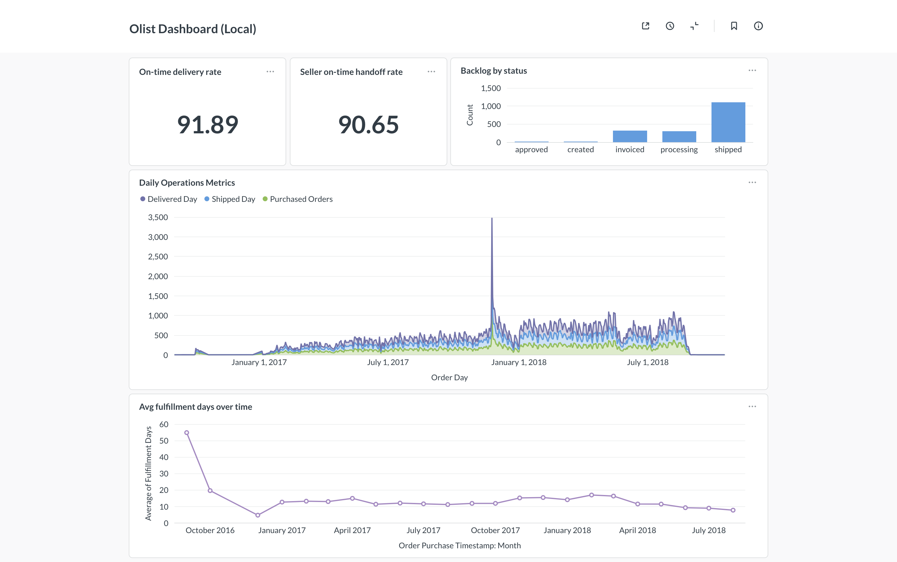

# Olist Logistics Operations Intelligence Dashboard (local)

>[!NOTE]
> Disclaimer: This project is for educational proposes. A part of Data Engineer Journal learning. It used [building-workshop-template](https://github.com/jack2000-dev/building-workshop-template) as a scaffolding AI assisted teaching. This project is local-based as of v0.1.0 New polished cloud-based version will build on this project (v0.2.0)



An end-to-end analytics engineering project built on the Olist Brazilian
e-commerce dataset. Raw SQLite source data is loaded into Postgres, modeled
with dbt using a medallion (raw → staging → marts) architecture, tested for
quality, and served through a Metabase dashboard that simulates near-real-time
operations monitoring.

This project was generated and built through the workshop scaffold in
`AGENT.md` and the `start/`, `before-assessment/`, `problem/`, `solution/`,
`learning-material/`, `after-assessment/`, and `score/` folders. The workshop
files remain in the repo for reference; this README documents the project that
was actually built.

## What The Project Does

Operations leaders at a logistics e-commerce company need a trusted dashboard
to monitor how orders move through fulfillment. The project answers:

- How many orders are purchased, shipped, and delivered each day?
- How long does fulfillment take?
- Are orders delivered before the estimated delivery date?
- Are sellers handing orders to carriers before their shipping deadline?
- How much operational backlog exists, and how much of it is at risk?
- Which customer or seller regions are associated with delays?

Because the Olist dataset is historical, "live updates" are simulated by
loading orders into Postgres in date-based batches.

## Architecture

```text
data/raw/olist.sqlite
        │
        │  pgloader (scripts/load_olist.load)
        ▼
Postgres  raw  schema  ──►  dbt staging (views, schema: staging)
                                  │
                                  ▼
                            dbt marts (tables, schema: marts)
                                  │
                                  ▼
                            Metabase dashboard
```

- **Raw**: untouched copy of the SQLite tables in Postgres `raw` schema.
- **Staging**: type-cast, renamed, lightly-filtered views. One model per source.
- **Marts**: fact, dimension, and daily aggregate tables with business logic.

## Tech Stack

- Python 3.13 with `uv` for environment and dependency management
- Postgres (local) as the analytics warehouse
- `pgloader` to copy the SQLite source into Postgres `raw`
- dbt Core + `dbt-postgres` for transformations and tests
- pytest for load-script sanity checks
- Metabase (via Docker Compose) for the dashboard
- `psycopg2-binary`, `pandas` for Python-side data work

## Repository Layout

```text
.
├── AGENT.md                      # Workshop teaching contract
├── README.md                     # This file
├── ROADMAP_v0.2.0.md             # Cloud-migration plan (next version)
├── docker-compose.yml            # Metabase service (local dev)
├── pyproject.toml                # uv / Python deps
├── data/raw/olist.sqlite         # Source Kaggle dataset
├── scripts/load_olist.load       # pgloader script: SQLite → Postgres raw
├── tests/test_load.py            # pytest row-count + table-exists checks
├── profiling/
│   ├── source_profile.md         # Pre-modeling profiling notes
│   └── queries/                  # Profiling SQL per table
├── olist/                        # dbt project (profile: olist)
│   ├── dbt_project.yml
│   ├── models/staging/           # stg_orders, stg_order_items, ...
│   ├── models/marts/             # fct_*, dim_*, daily_* + schema.yml
│   └── tests/                    # custom non-negative duration tests
├── docs/
│   ├── interview_notes.md        # Talking points for interviews
│   └── lecture.md
├── before-assessment/            # Workshop scaffold (kept for reference)
├── problem/                      # project-brief, milestones, assignment
├── solution/
├── learning-material/
├── after-assessment/
└── score/
```

## dbt Models

### Staging (`olist/models/staging/`)
`stg_orders`, `stg_order_items`, `stg_customers`, `stg_sellers`, `stg_products`,
`stg_order_payments`, `stg_product_category_name_translation`.

Materialized as views in schema `staging`. Casts timestamps, renames to
snake_case, filters null primary keys. No joins, no aggregation.

### Marts (`olist/models/marts/`)
Materialized as tables in schema `marts`.

| Model | Grain | Purpose |
|---|---|---|
| `fct_order_fulfillment` | one row per `order_id` | fulfillment days, on-time delivery flag |
| `fct_seller_order_fulfillment` | one row per `order_id + seller_id` | seller handoff SLA |
| `dim_customers` | one row per `customer_id` | customer geography |
| `dim_sellers` | one row per `seller_id` | seller geography |
| `dim_products` | one row per `product_id` | category, dimensions |
| `daily_operations_metrics` | one row per `order_day` | daily purchased / shipped / delivered counts |
| `daily_backlog_snapshot` | one row per open `order_id` | backlog + at-risk flag |

### Data Quality Tests

- Generic: `not_null` and `unique` on every fact-table primary key
- Custom singular tests in `olist/tests/`:
  - `assert_fulfillment_days_nonnegative.sql`
  - `assert_seller_handoff_days_nonnegative.sql`
- `accepted_values` test on `order_status` in staging

## Setup

### 1. Prerequisites
- Python 3.13 with [`uv`](https://docs.astral.sh/uv/) installed
- A local Postgres server you can connect to (the default load script points at
  `postgresql://jack2000@localhost:5432/olist` — adjust for your machine)
- [`pgloader`](https://pgloader.io/) installed
- Docker (for Metabase via `docker-compose.yml`)
- The Olist SQLite database from Kaggle placed at `data/raw/olist.sqlite`
  (and copied or symlinked to `/tmp/olist.sqlite` for the load script and tests)

### 2. Install Python dependencies
```bash
uv sync
```

### 3. Load raw data into Postgres
```bash
createdb olist        # if it does not exist yet
pgloader scripts/load_olist.load
```

### 4. Verify the load
```bash
uv run pytest tests/test_load.py
```

### 5. Build dbt models
Configure your dbt profile (`~/.dbt/profiles.yml`) under the profile name
`olist`, pointing at the same Postgres database, then:
```bash
cd olist
dbt build
```
This runs staging views, mart tables, and every test in one pass.

### 6. Start Metabase
```bash
docker compose up -d
```
Open <http://localhost:3000>, point Metabase at the `marts` schema of the
`olist` database, and build the dashboard.

## The Dashboard

The Metabase dashboard **Olist Operations Intelligence** is organized into:

1. **Operations overview** — daily purchased / shipped / delivered counts
2. **Fulfillment performance** — average fulfillment days over time
3. **SLA monitoring** — on-time delivery %, seller handoff SLA %
4. **Backlog monitoring** — total + at-risk backlog
5. **Regional breakdown** — delays by customer / seller state

## Known Limitations

- `customer_id` is order-scoped, not person-scoped in Olist — repeat-buyer
  analysis is not possible from this schema.
- The dataset is historical, so the "near-real-time" experience is simulated
  by batch-loading orders up to a chosen `batch_date`.
- 8 delivered orders have null `order_delivered_customer_date` — handled by
  null filters but flagged as a data-quality anomaly.
- Metabase is running on H2 storage (dev mode) per `docker-compose.yml`; not
  suitable for shared use.
- Postgres connection string is hard-coded in `tests/test_load.py` and
  `scripts/load_olist.load`. Moves to environment variables in v0.2.0.

## What's Next

The v0.2.0 plan is to lift this codebase off the laptop and onto cloud
infrastructure (managed Postgres + Metabase Cloud) so the dashboard can be
shared with stakeholders. See [`ROADMAP_v0.2.0.md`](./ROADMAP_v0.2.0.md) for
the milestones, decisions, and open questions.

## License

The files in this repository are licensed under the
[Creative Commons Attribution-ShareAlike 4.0 International License](https://creativecommons.org/licenses/by-sa/4.0/).
